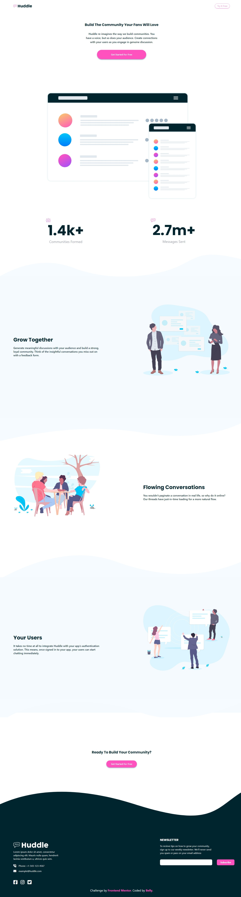
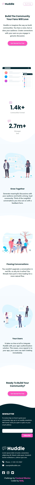

# Frontend Mentor - Clipboard landing page solution

This is a solution to the [Social links profile challenge on Frontend Mentor](https://www.frontendmentor.io/challenges/social-links-profile-UG32l9m6dQ). Frontend Mentor challenges help you improve your coding skills by building realistic projects.

## Table of contents

- [Overview](#overview)
  - [The challenge](#the-challenge)
  - [Screenshot](#screenshot)
  - [Links](#links)
- [My process](#my-process)
	- [Built with](#built-with)
	- [What I learned](#what-i-learned)
  - [Useful resources](#useful-resources)
- [Author](#author)

**Note: Delete this note and update the table of contents based on what sections you keep.**

## Overview

### The challenge

Users should be able to:

- See hover and focus states for all interactive elements on the page

### Screenshot




### Links

- Solution URL: [[solution URL here](https://github.com/Belly606/Huddle-landing-page-with-curved-sections/)]
- Live Site URL: [[live site URL here](https://belly606.github.io/Huddle-landing-page-with-curved-sections/)]

## My process

### Built with

- Semantic HTML5 markup
- CSS custom properties
- Flexbox
- CSS Grid
- Mobile-first workflow
- [Tailwind](https://tailwindcss.com/) - CSS Framework

### What I learned

Use this section to recap over some of your major learnings while working through this project. Writing these out and providing code samples of areas you want to highlight is a great way to reinforce your own knowledge.

```html
	<section class="user before:bg-[url(../images/bg-section-top-mobile-2.svg)] md:before:bg-[url('../images/bg-section-top-desktop-2.svg')] after:bg-[url('../images/bg-section-bottom-mobile-2.svg')] after:-bottom-8 after:h-32 md:after:bg-[url('../images/bg-section-bottom-desktop-2.svg')]">
```
```css
  .grow,
  .user {
    @apply md:mb-40 md:mt-56 py-24 md:bg-Very-Pale-Blue relative before:content-[''] before:absolute before:-top-4 md:before:-top-[150px] before:w-full before:h-28 md:before:h-[150px] before:bg-no-repeat before:bg-cover after:content-[''] after:absolute after:bottom-4 md:after:-bottom-40 after:w-full after:h-20 md:after:h-40 after:bg-no-repeat after:bg-cover;
  }
```

### Useful resources

- [Elzero HTML Course](https://elzero.org/study/html-2021-study-plan/) - This helped me for Understanding HTML & Make it a piece of Cake for me. I really appreciate he instructor so much.
- [Elzero CSS Course](https://elzero.org/study/css-2021-study-plan/) - This helped me for Understanding CSS & Make it a piece of Cake for me. I really appreciate he instructor so much.
- [Tailwind CSS Course](https://www.youtube.com/playlist?list=PLnD96kXp-_pMR9cBUmvsz_kIIt9bv2UIP) - This is an amazing course which helped me finally understand How Tailwind CSS Works. I'd recommend it to anyone still learning this concept.

## Author

- Github - [Belly](https://github.com/Belly606)
- Frontend Mentor - [@Belly606](https://www.frontendmentor.io/profile/Belly606)
